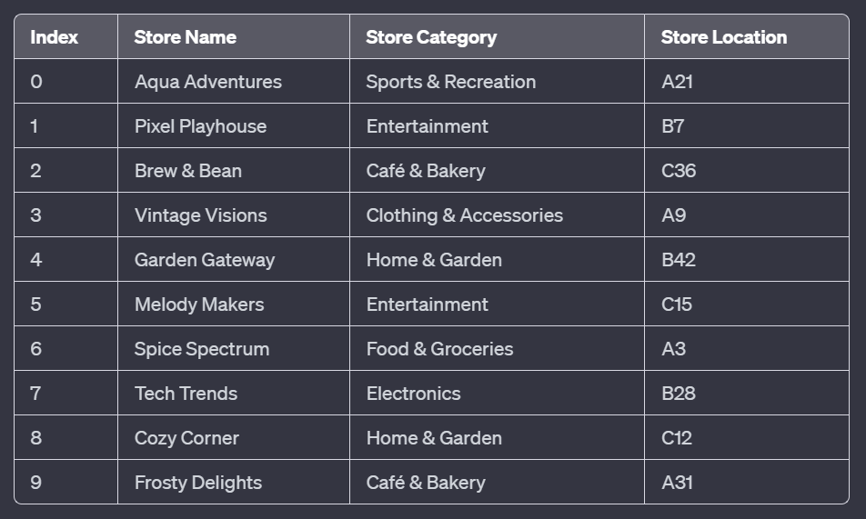

using System;
using System.Collections.Generic;
using System.Linq;
using System.Text;
using System.Threading.Tasks;

namespace GA_LinearSearch
{
    class README
    {
    }
}
Images/Table.PNG

using System;

class Program
{
    static void Main(string[] args)
    {
        Console.WriteLine("Custom List Class Example");
    }
}

using System;

public class CustomList<T>
{
    private T[] items;
    private int count;

    public CustomList() : this(10) { }

    public CustomList(int initialSize)
    {
        items = new T[initialSize];
    }

    // Additional methods will be added here.
}
public void Add(T item)
{
    CheckIntegrity();
    items[count++] = item;
}
public void AddAtIndex(T item, int index)
{
    CheckIntegrity();
    if (index < 0 || index > count) throw new ArgumentOutOfRangeException(nameof(index));
    for (int i = count; i > index; i--)
    {
        items[i] = items[i - 1];
    }
    items[index] = item;
    count++;
}
public bool Remove(T item)
{
    for (int i = 0; i < count; i++)
    {
        if (items[i].Equals(item))
        {
            for (int j = i; j < count - 1; j++)
            {
                items[j] = items[j + 1];
            }
            count--;
            return true;
        }
    }
    return false;
}
private void CheckIntegrity()
{
    if (count >= 0.8 * items.Length)
    {
        T[] largerArray = new T[items.Length * 2];
        Array.Copy(items, largerArray, count);
        items = largerArray;
    }
}
public T GetItem(int index)
{
    if (index < 0 || index >= count) throw new ArgumentOutOfRangeException(nameof(index));
    return items[index];
}
public int Count => count;

static void Main(string[] args)
{
    CustomList<string> myList = new CustomList<string>();
    myList.Add("Hello");
    myList.AddAtIndex("World", 1);
    // More tests for adding, removing, and retrieving items
}